# Delibrary 

프로젝트명 : 딜리브러리 - 도서관 웹 어플리케이션 프로젝트

팀명 : 탈주금지

참여인원 : 6명

개발기간 : 약 3개월

내용 : 도서대여 배달서비스 제공

개발환경 : MyBatis, Oracle, Spring Boot 4, Bootstrap 4,  JSP & Servlet, Javascript, Vue.js, jQuery

담당업무 : 게시판 및 댓글 CRUD, 페이징처리, 검색기능 등

## 주요 페이지

- 홈화면, 게시판 리스트

  ![홈화면]](img/home.png)
  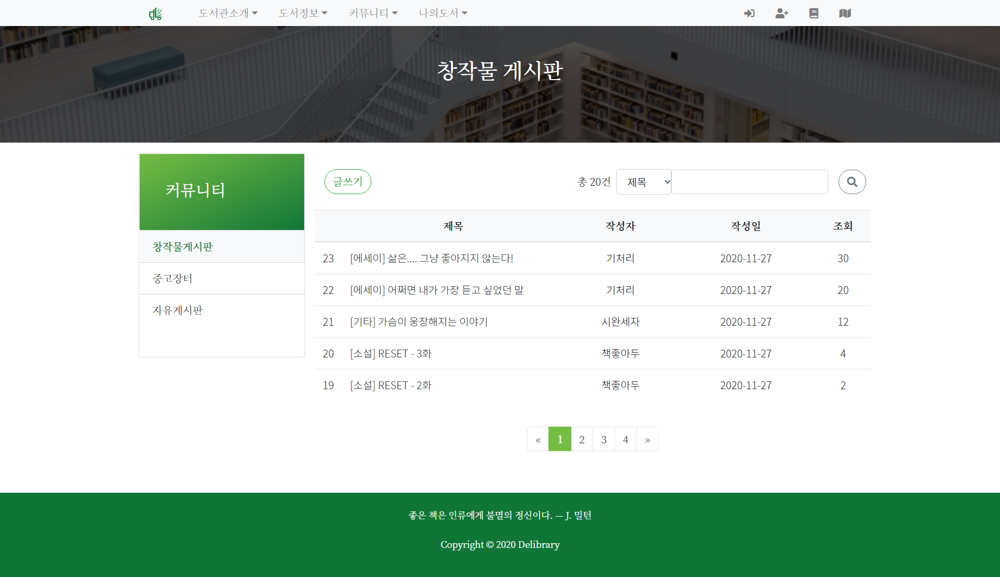

  모든 페이지는 부트스트랩을 적용해 반응형으로 만들어주었다.

- 헤더, 푸터 랜덤 이미지와 문구

  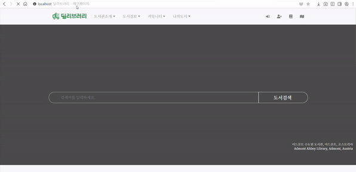
  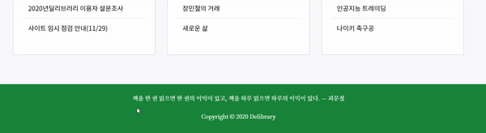

  자바스크립트를 이용해서 페이지를 새로고침 할때마다 헤더와 푸터에 나타나는 이미지와 문구를 랜덤으로 지정해주었다.

- 캐러셀

  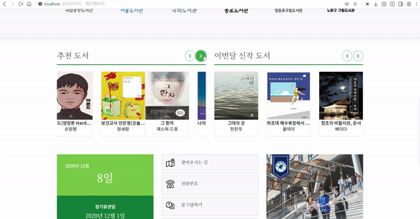

  홈화면에서 캐러셀을 이용해서 도서목록과 광고목록을 보여주도록 하였다.
  

## 게시판 

[PostController](https://github.com/inhalin/Delibrary/blob/main/Delibrary_Final/src/main/java/com/example/demo/controller/PostController.java)

1. 게시판

  - Read

  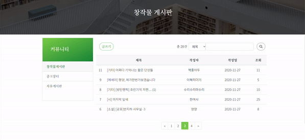

  게시판의 전체 목록을 보여주고 전체 게시글수 확인이 가능하다. 현재 페이지에 배경색을 주어 몇번째 페이지에 있는지 알 수 있다. 

  - Insert

  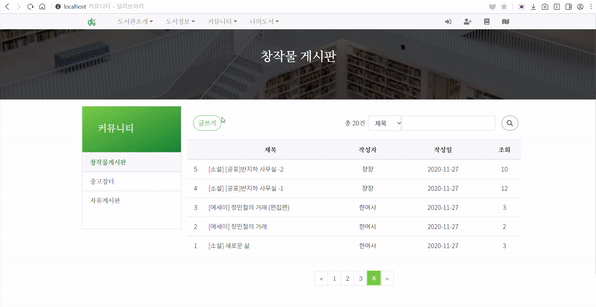

  로그인을 하지 않고 `글쓰기`를 클릭 할 경우 로그인 페이지로 이동시킨다.

  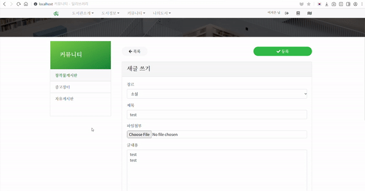

  글 작성시에는 말머리를 선택하고 제목, 내용을 쓰고 파일첨부가 가능하다.

  - Update

  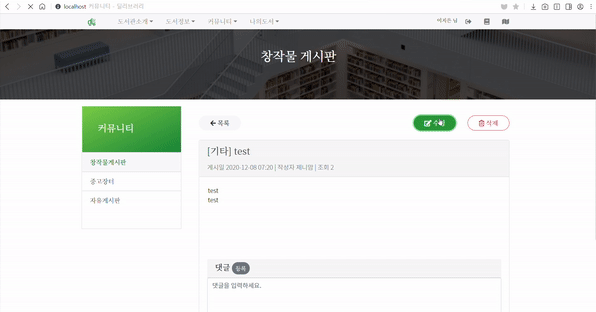

  글 수정은 본인과 관리자만 가능하다. 말머리, 제목, 내용, 첨부파일 전부 수정 가능하다.

  - Delete

  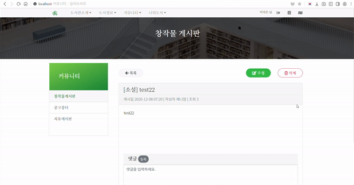

  글 삭제 또한 본인과 관리자만 가능하다. `삭제`버튼을 클릭할 경우 경고창을 띄워 확인시킨 후 삭제를 진행 또는 취소할 수 있다.

2. 댓글

  - Insert

  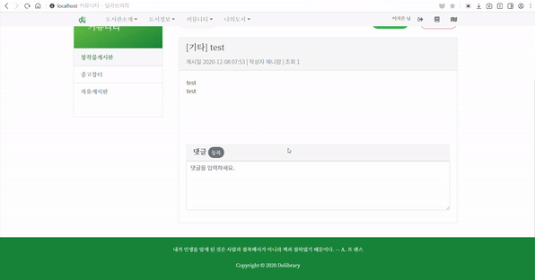
  
  댓글입력란에 내용을 입력하지 않은 상태에서 `등록` 버튼을 클릭할 경우 경고창을 띄운다.

  - Update, Delete

  

  댓글 수정 및삭제는 본인과 관리자만 가능하다. `삭제` 버튼을 클릭할 경우 경고창을 띄워 확인시킨 후 삭제를 진행 또는 취소할 수 있다.

3. 검색

  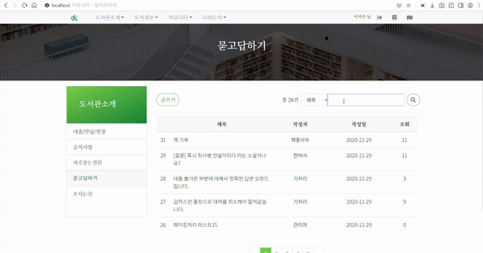

  제목, 작성자, 내용에 따라 검색이 가능하고, 검색으로 세션에 저장해 검색결과가 여러페이지일 경우에 페이지를 넘겨도 검색한 내용이 남아있어서 정상적으로 페이징 처리가 가능하게 해주었다.